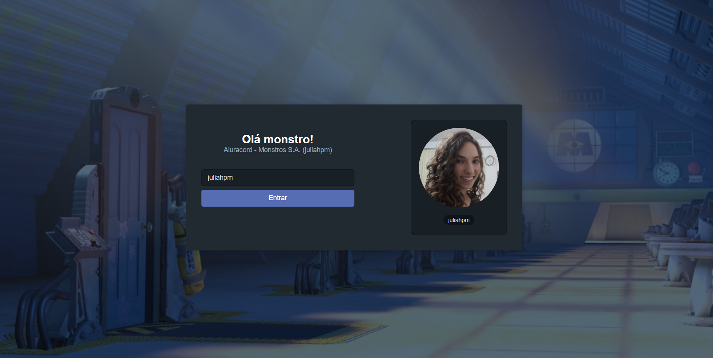
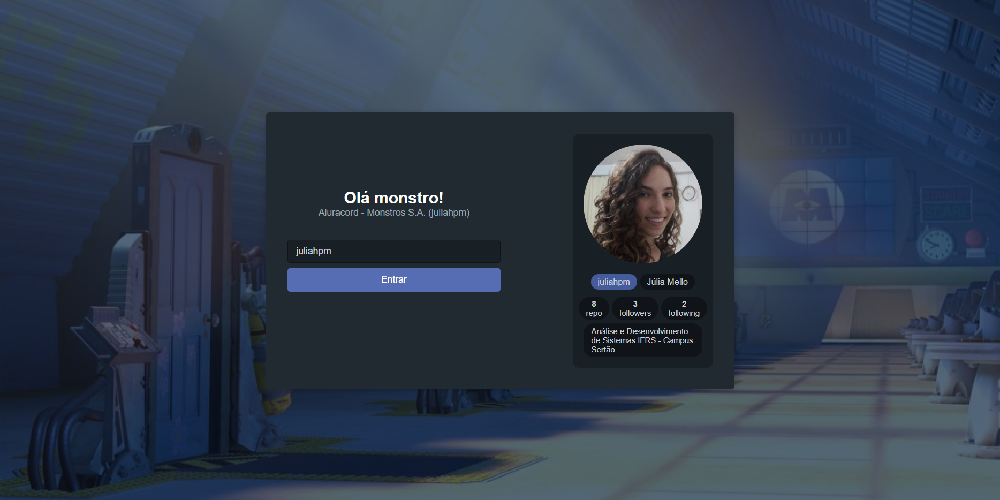
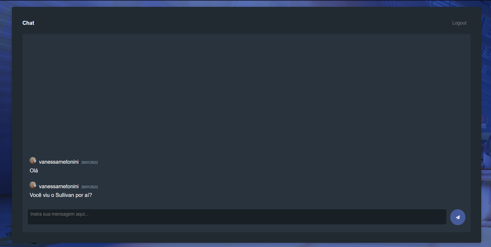

# Aluracord Montros S.A.
Código feito na Imersão React realizada pela Alura de 24 a 28 de janeiro de 2022.

[Acessar aplicação com hospedagem na Vercel](https://aluracord-monstros-sa.vercel.app/)


### Dependências
- Next.js 
- React.js ⚛️
- Skynexui 🎨

## Aula 1 - 24/01
Instalações e configurações iniciais. 
Criamos o layout de uma página inicial utilizando componentes do React e o skynexui para estilização.



Desafio: estilizar a sua maneira.

## Aula 2 - 25/01
Tópicos: useState, useRouter e eventos (onChange e onSubmit). 
Desafios: puxar mais dados do GitHub ✅ e deixar o botão de enviar desabilitado se não encontrar o nome de usuário.



## Aula 3 - 26/01
Utilizamos arrays, objetos e map para criar o chat offline.



Desafios: inserir botão de enviar e de excluir mensagem. ✅

## Aula 4 - 27/01
Integração com o Supabase como backend e 

Desafios: adicionar loading enquanto carrega as mensagens, mouse over para abrir profile do github e outos botões para mandar imagens e outros.

#### Run
```sh
npm run dev
```